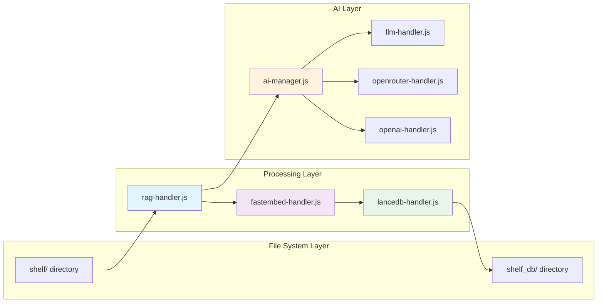

# RAG (Retrieval-Augmented Generation) System in SmartAdmin



## Overview

SmartAdmin implements a sophisticated RAG system that enhances AI responses with contextual knowledge from local documents, creating more informed and accurate AI interactions.

## Architecture

### **Core Components**

#### 1. **RAG Handler** (`rag-handler.js`)
- **Primary Controller**: Orchestrates the entire RAG pipeline
- **Initialization**: `initializeRAGSystem Function` sets up FastEmbed and LanceDB
- **Document Management**: Handles adding, searching, and refreshing knowledge base
- **Query Processing**: Converts user queries into vector searches

#### 2. **FastEmbed Engine** (`fastembed-handler.js`)
- **Model**: BGE-base-en (768-dimensional embeddings)
- **Alternative Models**: BGE-small-en (384D), BGE-large-en (1024D)
- **Functionality**: Converts text into dense vector representations
- **Similarity Metrics**: Multiple calculation methods for document relevance

#### 3. **LanceDB Vector Store** (`lancedb-handler.js`)
- **Database**: Apache Arrow-based vector database
- **Schema**: Structured storage for embeddings with metadata
- **Search**: Efficient similarity search with distance thresholds
- **Storage Location**: `~/Documents/smartadmin/shelf_db/`

## Knowledge Base Structure

### **Document Storage**
- **Source Directory**: `~/Documents/smartadmin/shelf/`
- **Format**: Markdown files (`.md`)
- **Content**: Administrative procedures, policies, SOPs
- **Processing**: Automatic description extraction from markdown

### **Vector Database Schema**
```javascript
// LanceDB Schema
{
  id: 'string',           // Unique document identifier
  text: 'string',         // Document description/content
  vector: 'float32[768]', // 768-dimensional embedding
  file: 'string'          // Source file path
}
```

## RAG Workflow

### **1. Document Ingestion**
```javascript
// From rag-handler.js
async function addDocument(text, id = null, filepath = '') {
  // Generate embeddings using FastEmbed
  const embeddingGen = await embedSentence(fastEmbedModel, [text]);
  
  // Store in LanceDB with metadata
  const item = { id, text, vector, file: filepath };
  return await addItem(item);
}
```

### **2. Library Refresh Process**
```javascript
// Automatic knowledge base updates
async function refreshLibrary() {
  // Load markdown files from shelf directory
  const latestKnowledge = await loadShelfData();
  
  // Process each document
  for (const item of latestKnowledge) {
    await addDocument(item.description, thisId, item.file);
  }
}
```

### **3. Query Processing**
```javascript
// Vector similarity search
async function searchRelevantDocs(query, limit = 5, distanceThreshold = null) {
  // Convert query to vector
  const queryVector = await embedSentence(fastEmbedModel, [query]);
  
  // Search similar documents
  return await searchSimilar(queryVector, limit, 'embeddings', distanceThreshold);
}
```

## Integration with AI System

### **Context Enhancement Pipeline**
The RAG system integrates with `ai-manager.js` to enhance AI responses:

```javascript
async function generateResponse(message, options = {}) {
  // Get 3 most relevant documents
  const relatedDocs = await searchRelevantDocs(message, 3, 0.5);
  
  // Build enhanced context
  const contextParts = [];
  for (const doc of relatedDocs) {
    let content = fs.readFileSync(doc.file, 'utf-8');
    contextParts.push(`[Source: ${filename}]\n${content}\n`);
  }
  
  // Inject context into user query
  contextMessage = `Context info:\n${context}\n\nUser Query:\n${message}`;
}
```

## Similarity Metrics

### **Multi-Metric Evaluation**
The system implements six similarity calculation methods in `fastembed-handler.js`:

1. **Cosine Similarity**: Primary metric for document relevance
2. **Euclidean Distance**: Geometric distance measurement
3. **Manhattan Distance**: L1 distance calculation
4. **Dot Product Similarity**: Vector multiplication scoring
5. **Jaccard Similarity**: Binary vector comparison
6. **Enhanced Cosine Similarity**: Threshold-based filtering (≥0.7)

### **Example Output**
```
📊 Cosine Similarity ("delivery policy"):
Rank | Score  | Document
----------------------------------------
 1   | 0.9598 | Delivery Address Change SOP
 2   | 0.9333 | Time Window Modification Rules
 3   | 0.8749 | Customer Service Guidelines
```

## Database Management

### **Retrieval Integration**
The RAG system can trigger database queries when documents indicate data retrieval needs:

```javascript
// From database-handler.js integration
async function checkDatabaseRetrievalRelated(content) {
  if (content.includes("## Database Query")) {
    const sqlQuery = await extractSQLFromMarkdown(content);
    const returnData = await executeQuery(sqlQuery);
    return { isDBRelated: true, data: returnData };
  }
}
```

## Performance Features

### **Efficient Processing**
- **Lazy Loading**: Models initialized on first use
- **Caching**: Vector embeddings cached for quick retrieval
- **Batch Processing**: Multiple documents processed simultaneously
- **Distance Thresholds**: Configurable relevance filtering

### **Real-time Updates**
- **Auto-refresh**: Library updates when new documents added
- **File Monitoring**: Detects changes in shelf directory
- **Incremental Updates**: Only processes modified documents

## Configuration & Initialization

### **Startup Sequence**
```javascript
// From main.js
await initializeRAGSystem();  // Initialize FastEmbed + LanceDB
await refreshLibrary();       // Load knowledge base
```

### **Status Monitoring**
```javascript
// Get RAG system status
async function getRAGStatus() {
  const allItems = await table.query().toArray();
  return { 
    itemCount: allItems.length, 
    itemIds: allItems.map(item => item.id) 
  };
}
```

## Use Cases

### **1. Policy Consultation**
- **Query**: "What's the delivery address change policy?"
- **RAG Response**: Retrieves relevant SOP documents
- **AI Output**: Policy-aware response with specific procedures

### **2. Administrative Guidance**
- **Query**: "How do I process a refund?"
- **RAG Response**: Finds refund processing guidelines
- **AI Output**: Step-by-step instructions based on documentation

### **3. Data-Driven Responses**
- **Query**: "Show recent orders with delivery issues"
- **RAG Response**: Triggers database query via markdown instructions
- **AI Output**: Live data analysis with contextual insights

## Benefits

### **Enhanced Accuracy**
- **Contextual Responses**: AI answers grounded in actual documentation
- **Reduced Hallucination**: Factual information from verified sources
- **Policy Compliance**: Responses aligned with organizational procedures

### **Knowledge Management**
- **Centralized Repository**: Single source of truth for procedures
- **Version Control**: Track document changes and updates
- **Searchable Knowledge**: Vector-based semantic search capabilities

### **Scalability**
- **Modular Design**: Easy to add new knowledge domains
- **Performance Optimization**: Efficient vector operations
- **Multi-Model Support**: Compatible with different embedding models

This RAG implementation transforms SmartAdmin from a simple chatbot into an intelligent administrative assistant that leverages organizational knowledge to provide accurate, context-aware responses for complex administrative tasks.