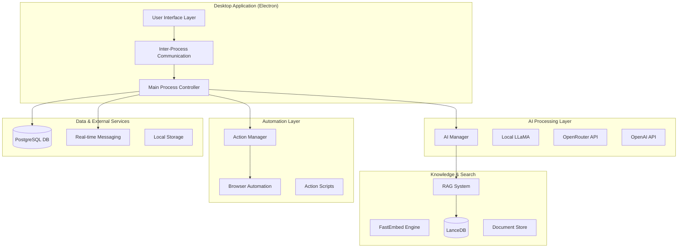
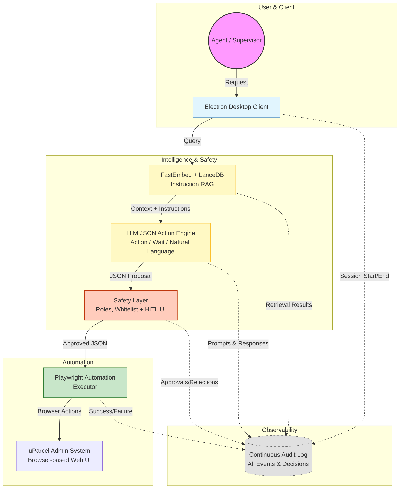
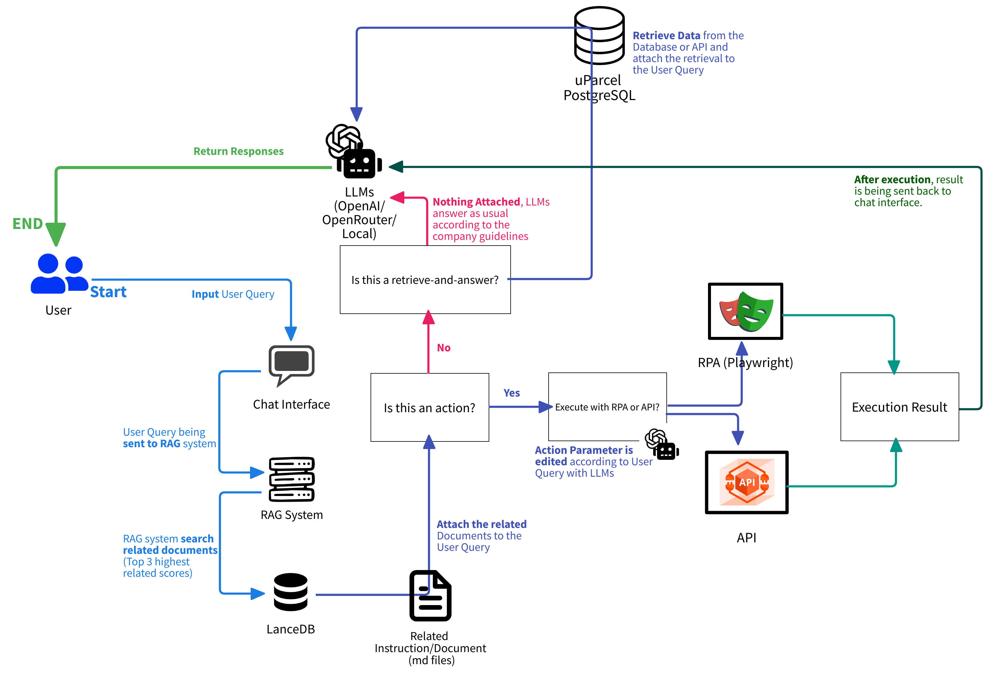
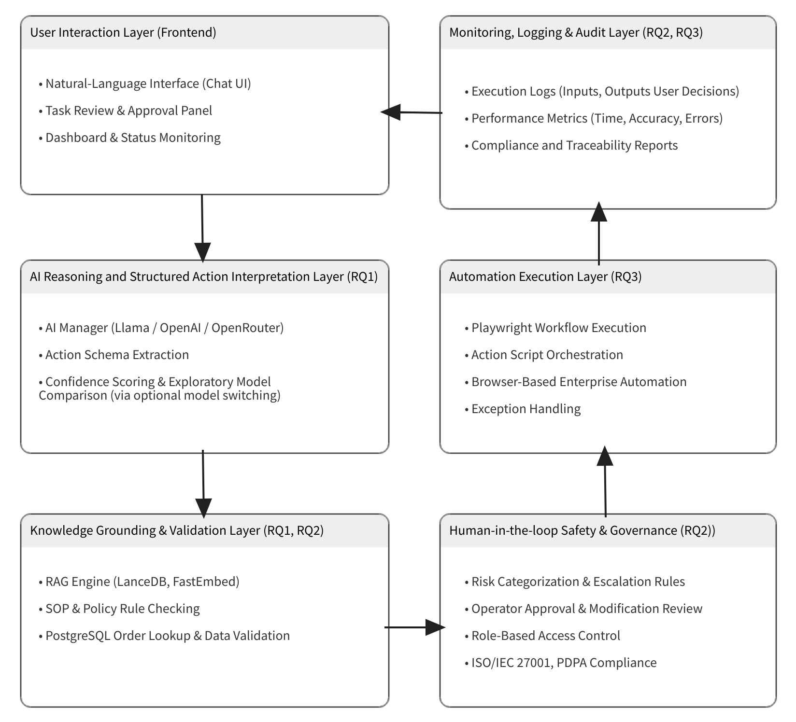
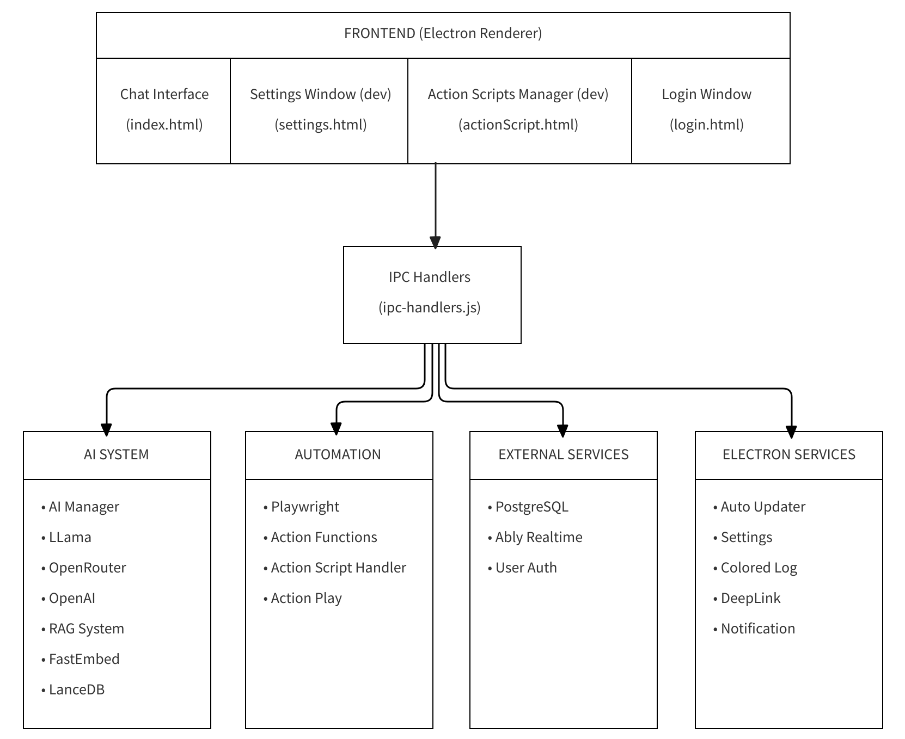

# SmartAdmin Application Architecture

## 1. System Overview

SmartAdmin is an Electron-based desktop application that provides AI-powered administrative automation with chat interface, action script management, and database integration.

### High-Level Application Architecture Diagram:



### High-Level System Architecture Diagram


## 2. Core Components

1. **Frontend Layer (Renderer Process)**
    - Chat interface (`src/pages/index.html`) - Main AI chat UI interface.
    - Settings Panel (`src/pages/settings.html`) - Configuration management.
    - Action Scripts Manager (`src/pages/actionScript.html`) - Automation workflow editor.
    - Login Interface (`src/pages/login.html`) - User authentication

2. **Main Process Controller**
    - Entry Point (`main.js`) - Application lifecycle management.
    - IPC Handlers (`src/modules/ipc-handlers.js`) - Communication bridge between processes.
    - Settings Handler (`src/modules/settings-handler.js`) - Configuration persistence.

3. **AI Processing System**
    - AI Manager (`src/modules/ai-manager.js`) - Unified AI orchestration.
    - Local LLaMA Handler (`src/modules/llm-handler.js`) - Local model integration.
    - OpenRouter Handler (`src/modules/openrouter-handler.js`) - Cloud AI API integration.
    - OpenAI Handler (`src/modules/openai-handler.js`) - Direct OpenAI integration.

4. **Knowledge & Retrieval System**
    - RAG Handler (`src/modules/rag-handler.js`) - Retrieval-Augmented Generation.
    - FastEmbed Handler (`src/modules/fastembed-handler.js`) - Vector embedding generation.
    - LanceDB Handler (`src/modules/lancedb-handler.js`) - Vector database management.

5. **Automation & Action System**
    - Action Handler (`src/modules/action-handler.js`) - Script lifecycle management.
    - Action Player (`src/modules/actionplay-handler.js`) - Browser automation execution.
    - Playwright Manager (`src/modules/playwright-manager.js`) - Browser instance management.
    - Action Functions (`src/modules/action-functions.js`) - Reusable utility functions.

6. **Data Layer**
    - Database Handler (`src/modules/database-handler.js`) - PostgreSQL integration.
    - User Authentication (`src/modules/user-authentication-handler.js`) - User session management.

7. **External Services**
    - Ably Handler (`src/modules/ably-handler.js`) - Real-time messaging.
    - Auto Updater (`src/modules/auto-updater.js`) - Application updates.

## 3. Key Features

**Multi-Modal AI Support**

- Supports local LLaMA models, OpenRouter, and OpenAI APIs.
- Unified interface through AIManager.
- Context-aware responses with RAG integration.

**Intelligent Document Retrieval**

- Vector-based document search using FastEmbed and LanceDB.
- Automatic relevance scoring and context injection.
- Document library management in shelf directory.

**Browser Automation**

- Playwright-powered action script recording and playback.
- Visual script editor with parameter support.
- Reusable action templates with project function integration.

**Real-time Collaboration**

- Ably-powered real-time messaging.
- User session management and authentication.
- Admin dashboard integration.

**Data Flow**

1. User Interaction → Chat interface receives input.
2. AI Processing → AIManager routes to appropriate AI provider.
3. Context Enhancement → RAG system retrieves relevant documents.
4. Database Integration → Queries PostgreSQL for additional context.
5. Action Execution → Triggers automated workflows if needed.
6. Response Generation → Returns enriched AI response to user.

## 4. Security & Configuration

- Settings Management - Centralized in `settings-handler.js`
- Authentication - User session validation through database
- File Security - Sandboxed action script execution
- Admin Controls - Admin dashboard for user and system management

## 5. Development Architecture

```
SmartAdmin-App/
├── main.js                                # Electron main process entry point
├── package.json                           # Dependencies and build configuration
├── package-lock.json                      # Dependency lock file
├── .gitignore                             # Git ignore patterns
│
├── build/                                 # Build resources 
│
├── dist/                                  # Built application output
│
├── scripts/                               # Build and utility scripts
│   ├── copy-browsers.js                   # Build script for packaging playwright browsers
|   ├── post-install.js                    # Post-install script to ensure Playwright browsers are available in the built app
│   └── publish-with-token.js              # Script to publish the app with authentication token
│
└── src/                                   # Source code directory
    ├── assets/                            # Static assets (icons, images, sounds)
    │
    ├── modules/                           # Core business logic modules
    │   ├── ably-handler.js                # Real-time messaging
    │   ├── action-functions.js            # Reusable utility functions
    │   ├── action-handler.js              # Automation script management
    │   ├── actionplay-handler.js          # Browser automation execution
    │   ├── ai-manager.js                  # AI orchestration and routing
    │   ├── auto-updater.js                # Application update system
    │   ├── colors-log.js                  # Enhanced logging system
    │   ├── database-handler.js            # PostgreSQL integration
    │   ├── deeplink-handler.js            # Electron Deep linking support
    │   ├── dlcode-handler.js              # Download role settings with code 
    │   ├── fastembed-handler.js           # Vector embedding generation
    │   ├── global-shortcuts.js            # Electron Global keyboard shortcuts
    │   ├── ipc-handlers.js                # Inter-process communication
    │   ├── lancedb-handler.js             # Vector database management
    │   ├── llm-handler.js                 # Local LLaMA model handler
    │   ├── openai-handler.js              # Direct OpenAI API integration
    │   ├── openrouter-handler.js          # OpenRouter/OpenAI API integration
    │   ├── os-notification.js             # Electron notifications system
    │   ├── otp-handler.js                 # One-time password management
    │   ├── playwright-manager.js          # Browser instance management
    │   ├── rag-handler.js                 # Retrieval-Augmented Generation
    │   ├── settings-handler.js            # Configuration management
    │   └── uparceluser-handler.js         # User authentication
    │
    ├── pages/                             # User interface files
    |   ├── css/                           # Stylesheets for pages
    |   |   ├── actionScript-styles.css    # Action script manager styles
    |   |   ├── notification.css           # Chat interface styles
    |   |   ├── settings-styles.css        # Settings panel styles
    |   |   └── styles.css                 # General styles
    |   |
    |   ├── js/                            # JavaScript for pages
    |   |   ├── actionScript.js            # Action script manager logic
    |   |   ├── login.js                   # User authentication logic
    |   |   ├── notification.js            # Chat interface logic
    |   |   ├── settings-config.js         # Settings template
    |   |   └── settings-manager.js        # Settings panel logic 
    |   |
    │   ├── actionScript.html              # Action script manager
    │   ├── banned.html                   # User Ban page
    │   ├── index.html                     # Main chat interface
    │   ├── login.html                     # User authentication UI
    │   ├── notification.html              # Electron notification
    │   ├── settings.html                  # Configuration panel
    │   └── splashScreen.html              # Splash screen when app starts
    |
    └── preload/                           # Security bridge scripts
```

## 6. More Diagrams

### End-to-End Workflow Flowchart



### Layered Architecture Diagram



### Developer Architecture Diagram


